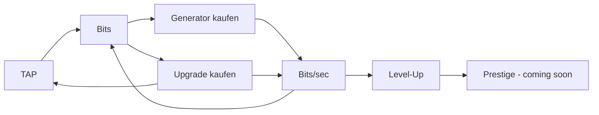

# 💻 Idle Hacker Tycoon

> **Vom Script Kiddie zum Root God.** Hacke, automatisiere und dominiere das Netz — direkt im Browser, optimiert für Smartphone.

<p align="center">
  
  
  
  
</p>

<p align="center">
  <a href="https://dabros-ai-coder.github.io/Idle-Hacker-Tycoon/"><strong>▶ Jetzt spielen (GitHub Pages)</strong></a> &nbsp;·&nbsp;
  <a href="#-quickstart">Quickstart</a> &nbsp;·&nbsp;
  <a href="#-features">Features</a> &nbsp;·&nbsp;
  <a href="#-roadmap">Roadmap</a>
</p>

---

## 🎮 Über das Spiel

**Idle Hacker Tycoon** ist ein Idle-/Tycoon-Web-Game mit Hacker-Thematik. Du startest mit einem einzigen Klick — einem Exploit — und baust dir Schritt für Schritt ein Imperium aus Botnets, Server-Farmen und autonomen KIs auf.

Kein Pay-to-Win, kein Backend nötig. Alles läuft lokal im Browser, speichert automatisch und rechnet sogar Offline-Gewinne.

```
[ TAP TO HACK ]  →  Bits  →  Server kaufen  →  Bits/sec  →  Upgrades  →  Prestige
```

---

## ✨ Features

| Kategorie | Details |
|---|---|
| **👆 Aktives Hacken** | Tap/Hold auf den Hack-Button, Float-Animation, Haptik (`navigator.vibrate`) |
| **🤖 5 Generatoren** | Script Kiddie → Botnet → Server Farm → Quantum Rig → KI-Schwarm |
| **⬆️ 5 Upgrades** | Klick-Multiplikatoren, Generator-Boosts, Global-Boost, Unlock-Ketten |
| **📈 Level-System** | 6 Ränge von *Script Kiddie* bis *Root God* mit Progress-Bar |
| **💾 Persistenz** | Auto-Save alle 5s + `visibilitychange` + `beforeunload`, `localStorage` |
| **🌙 Offline-Progress** | Bis zu 12h passives Einkommen nachrechnen beim Wiederkommen |
| **📱 Mobile-First** | `100dvh`, `safe-area-inset`, `clamp()`, 44px Touch-Targets, No-Zoom |
| **⚡ Performance** | Fixer Tick (10/s) + `requestAnimationFrame`, kein Framework-Overhead |

### Generatoren

| Icon | Name | Basis /sec | Basis-Kosten | Skalierung |
|---|---|---:|---:|---|
| 💻 | Script Kiddie | 0.5 | 15 | ×1.15 |
| 🤖 | Botnet | 4 | 100 | ×1.14 |
| 🖥️ | Server Farm | 30 | 1.100 | ×1.13 |
| ⚛️ | Quantum Rig | 220 | 12.000 | ×1.14 |
| 🧠 | KI-Schwarm | 1.600 | 130.000 | ×1.15 |

### Upgrades

| Icon | Name | Effekt | Preis |
|---|---|---|---:|
| ⌨️ | Mechanische Tastatur | Klick ×2 | 50 |
| 🥤 | Energy Drink IV | Klick ×2 | 500 |
| ⚡ | Script Optimierung | Script Kiddie +75% | 300 |
| 🛰️ | Botnet 2.0 | Botnet ×2 | 2.500 |
| 🔥 | Übertaktung | Alle ×1.5 | 15.000 |

---

## 🚀 Quickstart

### Variante A — Direkt öffnen
```bash
# Repo klonen
git clone https://github.com/Dabros-AI-Coder/Idle-Hacker-Tycoon.git
cd Idle-Hacker-Tycoon

# Einfach per HTTP serven (ES-Module brauchen einen Server)
npx http-server . -p 8080
# → http://localhost:8080
```

> `index.html` direkt via `file://` öffnet **nicht** — Browser blockieren ES-Module ohne HTTP.

### Variante B — GitHub Pages
`Settings` → `Pages` → `Source: main / root` → Link ist oben im Header.

---

## 🧱 Architektur

Vollmodular nach **OOP-Prinzipien**. Keine Gott-Klasse, lose Kopplung via EventBus.

```
Idle-Hacker-Tycoon/
├── index.html              # App-Shell, Tabs, Hack-Button
├── css/
│   └── style.css           # Mobile-First, CSS-Variablen, 560px Layout
└── js/
    ├── main.js             # Entry, --vh Fix, Game + UI Bootstrap
    ├── config/
    │   └── GameConfig.js   # ← Einzige Stelle für Balancing
    ├── core/
    │   ├── Game.js         # Facade: orchestriert Systeme, Loop, Save
    │   ├── GameLoop.js     # fixer Tick + rAF
    │   ├── EventBus.js     # Pub/Sub
    │   └── SaveManager.js  # localStorage Wrapper
    ├── systems/
    │   ├── EconomySystem.js     # Bits, Transaktionen
    │   ├── ClickSystem.js       # Tap-Logik, Multiplikatoren
    │   ├── AutomationSystem.js  # Generatoren, Kostenformel
    │   └── UpgradeSystem.js     # Once-Buy, Unlock-Kette
    ├── ui/
    │   └── UIManager.js    # Rendering, Tabs, Toasts, Float-Text
    └── utils/
        └── Formatter.js    # K/M/B/T, Zeit-Format
```

**Design-Prinzipien:**
- **Single Source of Truth** — Balancing nur in `GameConfig.js`
- **Event-driven** — Systeme sprechen nur über `EventBus`
- **Separation of Concerns** — `UIManager` enthält null Game-Logik
- **Kein Framework** — Vanilla JS (ES Modules), ~14 Dateien, <50kB

---

## 🎯 Gameplay-Loop



---

## 📱 Smartphone-Optimierung

- `viewport-fit=cover` + `env(safe-area-inset-*)` für Notch/Island
- `100dvh` + JS `--vh` Fallback für iOS Safari
- `touch-action: manipulation` + Doppel-Tap-Zoom-Block
- `clamp()` Typografie, `min-height: 44px` für alle Buttons
- Haptisches Feedback via `navigator.vibrate()`

Getestet: iOS Safari, Chrome Android, Firefox Mobile — Portrait & Landscape.

---

## 🗺️ Roadmap

- [x] **v0.1** — Core Loop, 5 Generatoren, 5 Upgrades, Save/Offline
- [ ] **v0.2** — Prestige-System (Root-Zugriff), Partikel-Effekte
- [ ] **v0.3** — Hack-Minigame (Timing/Pattern)
- [ ] **v0.4** — Achievements & Daily Rewards
- [ ] **v0.5** — Sound/Musik + Themes (Light/Dark/Hacker-Green)
- [ ] **v1.0** — Cloud-Save (optional), Leaderboard

Ideen & Bugs gerne als [Issue](../../issues) eröffnen!

---

## 🤝 Contributing

```bash
git checkout -b feature/mein-feature
# ... ändern, testen (npx http-server)
git commit -m "feat: mein Feature"
git push origin feature/mein-feature
# → Pull Request öffnen
```

Bitte: **OOP beibehalten**, Balancing nur in `GameConfig.js`, keine nicht-funktionalen Platzhalter.

---

## 📄 Lizenz

MIT — frei nutzbar, forke und hacke was du willst.

<p align="center">
  <sub>Mit 💚 gebaut von <a href="https://github.com/Dabros-AI-Coder">Dabros-AI-Coder</a> · PRs willkommen!</sub>
</p>
