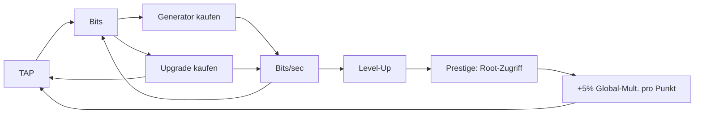

# 💻 Idle Hacker Tycoon

> **Vom Script Kiddie zum Root God.** Hacke, automatisiere und dominiere das Netz — direkt im Browser, optimiert für Smartphone.

<p align="center">
  
  
  
  
</p>

<p align="center">
  <a href="https://dabros-ai-coder.github.io/Idle-Hacker-Tycoon/"><strong>▶ Jetzt spielen (GitHub Pages)</strong></a> &nbsp;·&nbsp;
  <a href="#-quickstart">Quickstart</a> &nbsp;·&nbsp;
  <a href="#-features">Features</a> &nbsp;·&nbsp;
  <a href="#-roadmap">Roadmap</a>
</p>

---

## 🎮 Über das Spiel

**Idle Hacker Tycoon** ist ein Idle-/Tycoon-Web-Game mit Hacker-Thematik. Du startest mit einem einzigen Klick — einem Exploit — und baust dir Schritt für Schritt ein Imperium aus Botnets, Server-Farmen und autonomen KIs auf.

Kein Pay-to-Win, kein Backend nötig. Alles läuft lokal im Browser, speichert automatisch und rechnet sogar Offline-Gewinne.

```
[ TAP TO HACK ]  →  Bits  →  Server kaufen  →  Bits/sec  →  Upgrades  →  Prestige
```

---

## ✨ Features

| Kategorie | Details |
|---|---|
| **🎮 Hauptmenü** | *Spielen / Optionen / Beenden* — Spiel startet erst bei „Spielen“; In-Game `☰` Popup (Hauptmenü / Optionen / Beenden) mit Rückkehr zum Spiel; Optionen jetzt mit Subtabs *Optionen ↔ Statistiken* |
| **👤 Hacker-Name** | Beim ersten Start Pflicht-Popup „Wie sollen wir dich nennen?“ (milchiger Blur, Bestätigen/Enter) über In-Game, 2–16 Zeichen, änderbar in Optionen |
| **👆 Aktives Hacken** | Tap/Hold auf den Hack-Button, Float-Animation, Haptik (`navigator.vibrate`) |
| **🤖 17 Generatoren** | Script Kiddie → Proxy-Kette → Botnet → Krypto-Miner → Server Farm → DDoS-Rig → Quantum Rig → Zero-Day-Labor → KI-Schwarm → Deepfake-Studio → Darknet-Markt → Börsen-Coup → Satelliten-Uplink → Quanten-Rechenzentrum → Neural Overmind → Dyson-Botnetz → Singularitäts-Kern |
| **⬆️ 29 Upgrades** | Klick- & Generator-Boosts (1 pro Generator), 5 globale Übertaktungsstufen, Unlock-Ketten; Balance-capped Prestige-Multiplikator |
| **📈 Level-System** | 9 Ränge von *Script Kiddie* bis *Singularity* (bis 1B total) mit Progress-Bar |
| **👑 Prestige (Root-Zugriff)** | Ab 1M `totalEarned` resetten → 1 Punkt pro 1M, **+5 % Global-Multiplikator pro Punkt** (capped at 50%), permanent |
| **💾 CPU-Chip-Shop** | Zweitwährung aus Prestige, 6 leveled Permanent-Upgrades (Root-Tab), überlebt normalen Reset — löst das "Prestige verliert nach 2-3 Runs an Spannung"-Problem des reinen Auto-Multiplikators |
| **👻 Fiktive Rangliste** | 20 Plätze (19 NPCs + Du, `DU`-Badge), Gummiband: NPCs skalieren mit `+32% Prestige` + `12% Bits/Prestige` + `18% totalEarned` (All-Time) bzw. `22% aktuell`, 2 Tabs *All-Time / Aktuell*, Top-3 Gold/Silber/Bronze |
| **📊 Statistiken** | Aus `Stats`-Tab in Hauptmenü → Optionen → Statistiken verschoben; letzter In-Game-Tab ist jetzt reine Rangliste |
| **📱 PWA** | Installierbar (`manifest.json`, Icons), Standalone-Erkennung, Browser-Schutz (kein Rechtsklick/Markieren/Kopieren in der App) |
| **🖥️ Desktop (Tauri)** | Vite + Tauri (Rust), Fenster 560×800, `npm run tauri:dev/build` → `.exe/.msi`, selber `dist`-Build |
| **🔄 Auto-Update-Check** | Installierte App prüft `version.json` (Cache-Bypass) → Bestätigungsdialog bei neuer Version; „Später" gilt nur pro Session; Schleifenschutz 5 min |
| **💾 Persistenz** | Auto-Save alle 5s + `visibilitychange` + `beforeunload`, `localStorage` |
| **🛡️ Save-Schema** | Versioniertes Save-Format (`schemaVersion`) mit Migrations-Kette + Korruptions-Fallback (`save:corrupted`/`save:newer` Modals, Shape-Validierung, kein Crash) |
| **💾 Export/Import** | Spielstand als JSON-Code kopieren & wieder einfügen (Backup/Gerätewechsel) in Statistiken |
| **🌙 Offline-Progress** | Bis 12h passives Einkommen — **erst nach Neustart >2 Min offline** mit milchigem *Willkommen zurück*-Popup (Formel `Zeit × Leistung = Ertrag`, große Zahl, Bestätigen addiert Guthaben); Tab-Rückkehr ab 10s als Toast |
| **⏯️ Hintergrund-Betrieb** | Logik-Tick via `setInterval` weiter, auch minimiert; suspendierte Zeit als Catch-Up |
| **📴 Offline-fähig** | Service Worker (Network-First) — Updates sofort, offline letzter Stand |
| **📱 Mobile-First** | `100dvh`, `safe-area-inset`, `clamp()`, 44px Touch-Targets, No-Zoom |
| **🎓 Onboarding** | 4-stufiges Tutorial (HACK → Script Kiddie → Idle-Loop (perSec≥2) → Root bei 1M), optional, Bestandsspieler-Erkennung |
| **🎯 Hack-Minigame** | Alle 10 Hacks Timing-Bar (35-65% Sweet Spot → 3×), Auto-Miss nach 3s, WebAudio + Haptik |
| **🔊 Sound** | WebAudio Synth (Click/Buy/Prestige/Minigame), Toggle in Optionen, `AudioContext` resume |
| **🏆 Achievements** | 11 Erfolge (First Hack, 1K/100K, Netz online, Server-Farm, Upgrader, Root bereit, Root-Zugriff, Sammler, Netzwerk komplett, Stammgast), Toast + persist |
| **📅 Daily Bonus** | Täglich `500×Streak×Multi` (max 7), Streak via `lastClaim`, Claim in Erfolge-Tab |
| **🎨 Themes** | Auto (System) + Dark/Light/Hacker-Green, `data-theme`, `prefers-color-scheme`, Toggle in Optionen |
| **🛒 Bulk-Kauf** | Server-Kauf x1/x10/x100/Max, `getBulkCost`/`getMaxAffordable`/`buyBulk`, ROI-Anzeige |
| **📄 Impressum** | Hobby-Projekt, localStorage nur lokal, Plausible anonym, Modal über *Impressum & Datenschutz* |
| **🔄 Desktop-Updater** | Tauri `plugin-updater` + `plugin-process`, `latest.json` auf GitHub Releases, `check()`→`downloadAndInstall()`+`relaunch()` |
| **⚡ Performance** | Fixer Tick (10/s) + `requestAnimationFrame`, Vite-Bundling, kein Framework-Overhead |

### Generatoren

| Icon | Name | Basis /sec | Basis-Kosten | Skalierung |
|---|---|---:|---:|---|
| 💻 | Script Kiddie | 0.5 | 15 | ×1.15 |
| 🧦 | Proxy-Kette | 1.2 | 45 | ×1.14 |
| 🤖 | Botnet | 4 | 100 | ×1.14 |
| 🪙 | Krypto-Miner | 12 | 350 | ×1.14 |
| 🖥️ | Server Farm | 30 | 1.100 | ×1.13 |
| ⚡ | DDoS-Rig | 90 | 4.000 | ×1.14 |
| ⚛️ | Quantum Rig | 220 | 12.000 | ×1.14 |
| 🧪 | Zero-Day-Labor | 650 | 45.000 | ×1.15 |
| 🧠 | KI-Schwarm | 1.600 | 130.000 | ×1.15 |
| 🎭 | Deepfake-Studio | 4.800 | 500.000 | ×1.15 |
| 🕸️ | Darknet-Markt | 12.000 | 1,5M | ×1.15 |
| 🏦 | Börsen-Coup | 42.000 | 6,5M | ×1.14 |
| 🛰️ | Satelliten-Uplink | 95.000 | 20M | ×1.14 |
| 🏢 | Quanten-Rechenzentrum | 340.000 | 85M | ×1.15 |
| 🌌 | Neural Overmind | 900.000 | 300M | ×1.15 |
| 🌞 | Dyson-Botnetz | 3,2M | 1,3B | ×1.15 |
| ♾️ | Singularitäts-Kern | 14M | 6B | ×1.16 |

### Upgrades

| Icon | Name | Effekt | Preis |
|---|---|---|---:|
| ⌨️ | Mechanische Tastatur | Klick ×2 | 50 |
| ⚡ | Script Optimierung | Script Kiddie +75% | 300 |
| 🥤 | Energy Drink IV | Klick ×2 | 500 |
| 🛰️ | Botnet 2.0 | Botnet ×2 | 2.500 |
| 🔥 | Übertaktung | Alle ×1.5 | 15.000 |
| ❄️ | Quantum Cooling | Quantum Rigs ×2 | 80.000 |
| 🦾 | Bionische Finger | Klick ×3 | 100.000 |
| 🧬 | Schwarm-Protokoll | KI-Schwärme +150% | 600.000 |
| 🌋 | Übertaktung II | Alle ×2 | 2,5M |
| 🕶️ | Markt-Bot | Darknet-Märkte +150% | 4M |
| 📡 | Uplink-Turbo | Satelliten-Uplinks +150% | 40M |
| ☄️ | Übertaktung III | Alle ×3 | 100M |
| 🌠 | Übertaktung IV | Alle ×2 | 2B |
| 🪐 | Übertaktung V | Alle ×2,5 | 20B |

*(1 dediziertes Output-Upgrade pro Generator, hier nicht vollständig gelistet — siehe `GameConfig.js`.)*

### Prestige — Root-Zugriff

| Mechanik | Wert |
|---|---|
| Freischaltung | ab **1.000.000** total verdienten Bits, wächst danach ×1.3 pro Prestige (sonst wäre die Schwelle mit wachsenden permanenten Boni in Sekunden wieder erreicht) |
| Punkte | 1 Punkt pro 1M `totalEarned` (anteilig als Fortschritt sichtbar) — skaliert automatisch mit, da die Schwelle wächst |
| Effekt | **+5 %** auf Klick + alle Generatoren, pro Punkt (capped 50%) |
| Reset | Bits, Generatoren & Upgrades — Punkte bleiben permanent |

#### Prestige-Meilensteine (permanent)

| Prestiges | Meilenstein | Bonus |
|---:|---|---|
| 1 | 🌱 Wiedergeboren | Start nach jedem Reset mit **500 Bits** |
| 3 | 🛡️ Netz-Veteran | Start mit **25.000 Bits** |
| 5 | 👑 Legende des Netzes | **×2** auf Klick & alle Server — permanent |
| 10 | 🕵️ Schatten-Legion | Start mit **50.000 Bits** |
| 15 | ⚙️ System-Architekt | **×1.15** auf Klick & alle Server — permanent |
| 20 | 🧿 Unsichtbarer Admin | Start mit **150.000 Bits** |
| 25 | 🛠️ Root-Baumeister | **×1.15** auf Klick & alle Server — permanent |
| 30 | 🌐 Netzwerk-Souverän | Start mit **400.000 Bits** |
| 35 | 🚀 Exabyte-Architekt | **×1.2** auf Klick & alle Server — permanent |
| 40 | 🧬 Digitale Gottheit | Start mit **1.000.000 Bits** |
| 45 | 🕳️ Void-Operator | **×1.2** auf Klick & alle Server — permanent |
| 50 | 👁️ Allsehendes Auge | **×1.3** auf Klick & alle Server — permanent |

> Zielkurven (headless validiert via `js/utils/simulate.js`, 5 Klicks/s, greedy): erstes Prestige ~14 min, Satelliten-Uplink ~51 min, Neural Overmind ~75 min, Singularitäts-Kern ~88 min — mit Prestige-Multiplikatoren entsprechend schneller. Mehrfach-Prestige-Kadenz (`js/utils/simulateMultiPrestige.js`, gleicher greedy Bot): Prestige 1→5 dauert 14 → 11 → 9 → 5 → 3 Minuten (spürbar gestaffelt statt trivial), danach kollabiert die Kadenz unter einem theoretisch perfekten Dauer-Optimal-Bot auf Sekunden-Bruchteile — ein bekanntes Idle-Game-Artefakt unbegrenzter Reinvestition pro Tick, das reale Spieler (keine 10 Käufe/Sekunde) praktisch nicht erreichen.

#### 💾 CPU-Chip-Shop (Zweitwährung, überlebt Prestige)

Der Multiplikator aus Root-Keys ist bei ×1.5 gedeckelt — sonst würde Root-Zugriff nach wenigen Durchläufen jede Spannung verlieren. Deshalb gibt's zusätzlich **CPU-Chips**: bei jedem Root-Zugriff im gleichen Umfang wie Root-Keys gutgeschrieben, aber **ausgegeben** statt automatisch verrechnet — im permanenten Shop im Root-Tab. Käufe bleiben über jeden normalen Reset hinweg erhalten (nur ein kompletter Save-Wipe löscht sie), Kosten steigen pro Stufe geometrisch (`baseCost × costMultiplier^level`).

| Icon | Name | Effekt/Stufe | Max-Level | Basiskosten |
|---|---|---|---:|---:|
| 🔑 | Root-Protokoll | +5% alle Server | 30 | 2 |
| 🧠 | Neuronale Beschleunigung | +10% Klick-Power | 20 | 1 |
| 📈 | Effiziente Extraktion | +10% Root-Keys & Chips pro Prestige | 15 | 5 |
| 💼 | Notfall-Fonds | +50.000 Start-Bits nach Reset | 10 | 3 |
| 🌙 | Autonomie-Kern | +25% Offline-Cap | 8 | 4 |
| 💰 | Schwarzmarkt-Kontakte | Generator-Kosten -2% (max. -50%) | 10 | 6 |

---

## 🚀 Quickstart

### Variante A — Vite (Web, empfohlen)
```bash
git clone https://github.com/Dabros-AI-Coder/Idle-Hacker-Tycoon.git
cd Idle-Hacker-Tycoon
npm install

npm run dev      # → http://localhost:1420  (Vite + HMR)
npm run build    # → dist/ (für GitHub Pages)
npm run preview  # → Vorschau des Builds auf http://localhost:4173
```

> `index.html` direkt via `file://` öffnet **nicht** — Browser blockieren ES-Module ohne HTTP. Vite löst das (dient via HTTP + bundelt für Production).

### Variante B — Tauri Desktop (.exe)
```bash
# Voraussetzung: Rust + Visual Studio Build Tools (Windows) installiert
npm run tauri:dev    # Desktop-Fenster im Dev-Modus (Vite auf Port 1420)
npm run tauri:build  # → src-tauri/target/release/bundle/ (.exe / .msi)
```
Fenster: 560×800, zentriert, resizable. Nutzt denselben `dist`-Build wie Web — kein Code-Duplikat.

### Tests & Balance-Simulation
```bash
npm test                 # alias für node tests/run.js (23 Tests)
node js/utils/simulate.js    # Headless Balance-Simulation (30 min Standard)
```

### Variante C — GitHub Pages
`Settings` → `Pages` → `Source: GitHub Actions` — Workflow `.github/workflows/deploy.yml` baut via `npm run build` nach `dist/` und deployed. Alternativ `main / root` für direkten Pages-Deploy ohne Build.

---

## 🧱 Architektur

Vollmodular nach **OOP-Prinzipien**. Keine Gott-Klasse, lose Kopplung via EventBus.

```
Idle-Hacker-Tycoon/
├── index.html              # App-Shell, Tabs (Server/Upgrades/Root/Rang), Hack-Button
├── manifest.json           # PWA Manifest (installierbar)
├── sw.js                   # Service Worker: Network-First + Offline-Fallback
├── version.json            # Remote-Version für Update-Check
├── vite.config.js          # Vite (base /Idle-Hacker-Tycoon/ auf GH Actions, copyStatic)
├── package.json            # Vite 6 + Tauri 2
├── css/
│   └── style.css           # Mobile-First, CSS-Variablen, 560px Layout, Milch-Blur Modals
├── assets/                 # PWA Icons (192/512/apple-touch)
├── .github/workflows/deploy.yml # Pages Deploy (npm ci → test → build → dist)
├── src-tauri/              # Tauri Rust (560×800, Icons)
└── js/
    ├── main.js             # Entry, --vh Fix, Standalone/Updater, Leaderboard-Tabs
    ├── config/
    │   └── GameConfig.js   # ← Einzige Stelle für Balancing (v0.10.0)
    ├── core/
    │   ├── Game.js         # Facade: Systeme, Loop, Save, Offline 2min/pending, Gummiband, Achievements/Daily
    │   ├── GameLoop.js     # fixer Tick via setInterval + rAF
    │   ├── Options.js      # Optionen (Vibration, Sound, Theme, Offline, Username) — separates Key
    │   ├── EventBus.js     # Pub/Sub
    │   ├── SaveManager.js  # localStorage + Shape-Validierung + isCorrupted()
    │   └── UpdateManager.js# version.json Check, Hard-Reload, Tauri updater ergänzt
    ├── systems/
    │   ├── EconomySystem.js     # Bits, Transaktionen
    │   ├── ClickSystem.js       # Tap-Logik
    │   ├── AutomationSystem.js  # Generatoren, Bulk x10/x100/Max
    │   ├── UpgradeSystem.js     # Once-Buy
    │   ├── PrestigeSystem.js    # Root-Zugriff
    │   ├── AchievementSystem.js # 10 Erfolge
    │   └── DailyRewardSystem.js # Streak 7, 500×Streak×Multi
    ├── ui/
    │   ├── UIManager.js    # Rendering, Tabs, Daily/Erfolge, Bulk, Impressum, Modals
    │   ├── MainMenu.js     # Hauptmenü, Username, Themes, In-Game Popup
    │   └── HackMinigame.js # Timing-Bar alle 10 Hacks 3×
    └── utils/
        ├── Formatter.js    # K/M/B/T, Zeit
        ├── haptics.js      # Vibration
        ├── audio.js        # WebAudio Synth
        └── simulate.js     # Headless Sim
        ├── haptics.js      # Zentrale Vibration (respektiert Optionen)
        └── simulate.js     # Headless Balance-Simulation (Node)
```

**Design-Prinzipien:**
- **Single Source of Truth** — Balancing nur in `GameConfig.js`
- **Event-driven** — Systeme sprechen nur über `EventBus`
- **Separation of Concerns** — `UIManager` enthält null Game-Logik
- **Kein Framework** — Vanilla JS (ES Modules) + Vite/Tauri, ~22 Dateien

---

## 🎯 Gameplay-Loop



---

## 🔄 Update-Mechanik (PWA)

Installierte Apps (Standalone) prüfen beim Start (+2s) und bei Rückkehr in den Vordergrund, ob der Server eine neuere `version.json` anbietet:

1. **Neue Version gefunden** → Bestätigungsdialog mit *Aktualisieren* / *Später*
2. **Später** → Popup schließt, gilt nur für die **aktuelle Session** — beim nächsten App-Start wird erneut gefragt
3. **Aktualisieren** → Caches + alten Service Worker entfernen, Hard-Reload mit Cache-Bust
4. **Schleifenschutz** → Liefert der Server (CDN/HTTP-Cache) die neue Version noch nicht, wird max. 5 min lang nicht erneut gefragt

> Release-Prozess: `version.json` bumpen und deployen ist genug — installierte Clients melden sich selbst. Der Service Worker holt Assets grundsätzlich **network-first**, Updates sind also sofort sichtbar.

---

## 🌙 Offline & Hintergrund

- **Minimiert/im Hintergrund:** Logik-Tick via `setInterval` weiter (rAF würde pausiert). Wird das Tab komplett eingefroren (z. B. Mobile), rechnet `Game` beim Rückkehren die suspendierte Zeit als Catch-Up nach (>10s, gedeckelt auf 12h) und speichert sofort.
- **App geschlossen:** Erst nach **>2 Min** offline beim nächsten Start mit milchigem *Willkommen zurück*-Popup (Formel `Zeit × Leistung = Ertrag`, große Zahl, Bestätigen addiert Guthaben). Unter 2 Min kein Popup.
- **Kein Netz:** Service Worker liefert zuletzt geladene Ressourcen aus dem Cache — spielbar.

---

## 📱 Smartphone-Optimierung

- `viewport-fit=cover` + `env(safe-area-inset-*)` für Notch/Island
- `100dvh` + JS `--vh` Fallback für iOS Safari
- `touch-action: manipulation` + Doppel-Tap-Zoom-Block
- `clamp()` Typografie, `min-height: 44px` für alle Buttons
- Haptisches Feedback via `navigator.vibrate()`

Getestet: iOS Safari, Chrome Android, Firefox Mobile — Portrait & Landscape.

### Als App installieren

- **Android/Chrome:** Menü → *Zum Startbildschirm hinzufügen* / *App installieren*
- **iOS/Safari:** Teilen → *Zum Home-Bildschirm*

Die installierte App läuft ohne Browser-UI, blockiert Text-Manipulation und prüft selbstständig auf Updates.

---

## 🗺️ Roadmap

- [x] **v0.1** — Core Loop, 5 Generatoren, 5 Upgrades, Save/Offline
- [x] **v0.2** — PWA (installierbar, Icons), Standalone-Schutz
- [x] **v0.3** — Prestige (Root-Zugriff), Auto-Update-Check mit Popup
- [x] **v0.3.2** — Hintergrund-Betrieb, Offline-Catch-Up mit Modal, Service Worker + Update-Fix
- [x] **v0.3.3** — Save-Schema-Versionierung (Migration) + Export/Import
- [x] **v0.4** — Balance-Tiefe: 8 Generatoren, 11 Upgrades, Level bis 1B, Prestige-Meilensteine
- [x] **v0.4.1** — Open-Beta-Polish: Onboarding, Test-Suite, Social-Preview
- [x] **v0.4.2** — Hauptmenü (Spielen/Optionen/Beenden) + Benutzeroptionen
- [x] **v0.4.3** — Feedback mit System-Info, PWA-Install-Prompt, Plausible Analytics
- [x] **v0.4.4** — Balance-Cap: Prestige-Bonus capped at 50%, neue Upgrades (7 Stück)
- [x] **v0.4.5** — NPC-Leaderboard (20 Positionen, Single-Player Motivations-Hilfe)
- [x] **v0.5.0** — Polished Beta: Vite 6 + Tauri Desktop, dynamisches Gummiband-Leaderboard (All-Time/Aktuell + Spieler), Username-Pflicht (milchig), Offline 2min-Willkommen, In-Game Popup + Rückkehr, Statistiken→Optionen, Save-Korruptions-Fallback, 4-Step Tutorial, Pages-CI
- [x] **v0.6.0** — P1: Hack-Minigame (alle 10 Hacks Timing-Bar 3×), Sound/Haptik (WebAudio, Options-Toggle), Achievements (10) + Daily (Streak 7), Balance bis 100M validiert
- [x] **v0.7.0** — P2: Themes (Auto/Dark/Light/Hacker), Bulk-Kauf x10/x100/Max, Impressum/Datenschutz, Tauri Auto-Updater (latest.json)
- [x] **v0.8.0** — Längere Progression: 9 neue Generatoren (8→17), 11 neue Upgrades (Ø 1 pro neuem Generator + Übertaktung IV/V), Achievement „Netzwerk komplett“
- [x] **v0.9.0** — CPU-Chip-Shop: Prestige-Zweitwährung mit 6 leveled Permanent-Upgrades, überlebt normale Resets — hält Root-Zugriff auch nach vielen Durchläufen spannend
- [x] **v0.10.0** — 9 neue Prestige-Meilensteine (bis Prestige 50), Prestige-Schwelle wächst ×1.3/Prestige (löst triviale Wiederholungs-Prestiges), Bugfix: Meilenstein-Multiplikator wirkte bisher nicht auf Klicks
- [ ] **v1.0** — Cloud-Save (optional)

Ideen & Bugs gerne als [Issue](../../issues) eröffnen!

**Stand: v0.10.0** – 17 Generatoren, 29 Upgrades, CPU-Chip-Shop, 12 Prestige-Meilensteine, wachsende Prestige-Schwelle.

---

## 🤝 Contributing

```bash
git checkout -b feature/mein-feature
# ... ändern, testen (npm run build, npm test)
git commit -m "feat: mein Feature"
git push origin feature/mein-feature
# → Pull Request öffnen
```

Bitte: **OOP beibehalten**, Balancing nur in `GameConfig.js`, keine nicht-funktionalen Platzhalter.

---

## 📄 Lizenz

MIT — frei nutzbar, forke und hacke was du willst.

<p align="center">
  <sub>Mit 💚 gebaut von <a href="https://github.com/Dabros-AI-Coder">Dabros-AI-Coder</a> · PRs willkommen!</sub>
</p>
