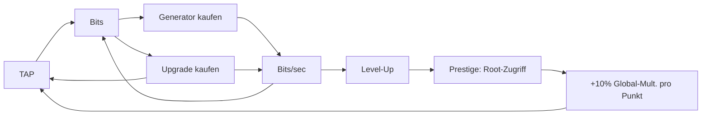

# 💻 Idle Hacker Tycoon

> **Vom Script Kiddie zum Root God.** Hacke, automatisiere und dominiere das Netz — direkt im Browser, optimiert für Smartphone.

<p align="center">
  
  
  
  
</p>

<p align="center">
  <a href="https://dabros-ai-coder.github.io/Idle-Hacker-Tycoon/"><strong>▶ Jetzt spielen (GitHub Pages)</strong></a> &nbsp;·&nbsp;
  <a href="#-quickstart">Quickstart</a> &nbsp;·&nbsp;
  <a href="#-features">Features</a> &nbsp;·&nbsp;
  <a href="#-roadmap">Roadmap</a>
</p>

---

## 🎮 Über das Spiel

**Idle Hacker Tycoon** ist ein Idle-/Tycoon-Web-Game mit Hacker-Thematik. Du startest mit einem einzigen Klick — einem Exploit — und baust dir Schritt für Schritt ein Imperium aus Botnets, Server-Farmen und autonomen KIs auf.

Kein Pay-to-Win, kein Backend nötig. Alles läuft lokal im Browser, speichert automatisch und rechnet sogar Offline-Gewinne.

```
[ TAP TO HACK ]  →  Bits  →  Server kaufen  →  Bits/sec  →  Upgrades  →  Prestige
```

---

## ✨ Features

| Kategorie | Details |
|---|---|
| **👆 Aktives Hacken** | Tap/Hold auf den Hack-Button, Float-Animation, Haptik (`navigator.vibrate`) |
| **🤖 8 Generatoren** | Script Kiddie → Botnet → Server Farm → Quantum Rig → KI-Schwarm → Darknet-Markt → Satelliten-Uplink → Neural Overmind |
| **⬆️ 11 Upgrades** | Klick-Multiplikatoren, Generator-Boosts, Global-Boosts, Unlock-Ketten bis 40M Bits |
| **📈 Level-System** | 9 Ränge von *Script Kiddie* bis *Singularity* (bis 1B total) mit Progress-Bar |
| **👑 Prestige (Root-Zugriff)** | Ab 1M `totalEarned` resetten → 1 Punkt pro 1M, **+10 % Global-Multiplikator pro Punkt**, permanent |
| **📱 PWA** | Installierbar (`manifest.json`, Icons), Standalone-Erkennung, Browser-Schutz (kein Rechtsklick/Markieren/Kopieren in der App) |
| **🔄 Auto-Update-Check** | Installierte App prüft `version.json` (Cache-Bypass) → Bestätigungsdialog bei neuer Version; „Später" gilt nur pro Session; Schleifenschutz falls das CDN die neue Version noch nicht ausliefert |
| **💾 Persistenz** | Auto-Save alle 5s + `visibilitychange` + `beforeunload`, `localStorage` |
| **🛡️ Save-Schema** | Versioniertes Save-Format (`schemaVersion`) mit Migrations-Kette — alte Spielstände bleiben kompatibel; Saves von neueren Versionen werden abgelehnt statt zu crashen |
| **💾 Export/Import** | Spielstand als JSON-Code kopieren & wieder einfügen (Backup/Gerätewechsel) im Stats-Tab |
| **🌙 Offline-Progress** | Bis zu 12h passives Einkommen nachrechnen — beim Spielstart mit *Willkommen-zurück*-Modal, bei Tab-Rückkehr als Catch-Up (>10s Abwesenheit) |
| **⏯️ Hintergrund-Betrieb** | Logik-Tick läuft via `setInterval` weiter, auch wenn das Tab minimiert ist; suspendierte Zeit wird beim Rückkehren gutgeschrieben |
| **📴 Offline-fähig** | Service Worker (Network-First) — Updates kommen sofort an, offline dient der letzte Stand |
| **📱 Mobile-First** | `100dvh`, `safe-area-inset`, `clamp()`, 44px Touch-Targets, No-Zoom |
| **🎓 Onboarding** | 3-stufiges Tutorial für neue Spieler (HACK → erster Server → Idle-Loop erklärt), überspringbar; Bestandsspieler werden automatisch erkannt |
| **⚡ Performance** | Fixer Tick (10/s) + `requestAnimationFrame` fürs Rendering, kein Framework-Overhead |

### Generatoren

| Icon | Name | Basis /sec | Basis-Kosten | Skalierung |
|---|---|---:|---:|---|
| 💻 | Script Kiddie | 0.5 | 15 | ×1.15 |
| 🤖 | Botnet | 4 | 100 | ×1.14 |
| 🖥️ | Server Farm | 30 | 1.100 | ×1.13 |
| ⚛️ | Quantum Rig | 220 | 12.000 | ×1.14 |
| 🧠 | KI-Schwarm | 1.600 | 130.000 | ×1.15 |
| 🕸️ | Darknet-Markt | 12.000 | 1,5M | ×1.15 |
| 🛰️ | Satelliten-Uplink | 95.000 | 20M | ×1.14 |
| 🌌 | Neural Overmind | 900.000 | 300M | ×1.15 |

### Upgrades

| Icon | Name | Effekt | Preis |
|---|---|---|---:|
| ⌨️ | Mechanische Tastatur | Klick ×2 | 50 |
| ⚡ | Script Optimierung | Script Kiddie +75% | 300 |
| 🥤 | Energy Drink IV | Klick ×2 | 500 |
| 🛰️ | Botnet 2.0 | Botnet ×2 | 2.500 |
| 🔥 | Übertaktung | Alle ×1.5 | 15.000 |
| ❄️ | Quantum Cooling | Quantum Rigs ×2 | 80.000 |
| 🦾 | Bionische Finger | Klick ×3 | 100.000 |
| 🧬 | Schwarm-Protokoll | KI-Schwärme +150% | 600.000 |
| 🌋 | Übertaktung II | Alle ×2 | 2,5M |
| 🕶️ | Markt-Bot | Darknet-Märkte +150% | 4M |
| 📡 | Uplink-Turbo | Satelliten-Uplinks +150% | 40M |

### Prestige — Root-Zugriff

| Mechanik | Wert |
|---|---|
| Freischaltung | ab **1.000.000** total verdienten Bits |
| Punkte | 1 Punkt pro 1M (anteilig als Fortschritt sichtbar) |
| Effekt | **+10 %** auf Klick + alle Generatoren, pro Punkt |
| Reset | Bits, Generatoren & Upgrades — Punkte bleiben permanent |

#### Prestige-Meilensteine (permanent)

| Prestiges | Meilenstein | Bonus |
|---:|---|---|
| 1 | 🌱 Wiedergeboren | Start nach jedem Reset mit **500 Bits** |
| 3 | 🛡️ Netz-Veteran | Start mit **25.000 Bits** |
| 5 | 👑 Legende des Netzes | **×2** auf Klick & alle Server — permanent |

> Zielkurven (headless validiert via `js/utils/simulate.js`, 5 Klicks/s, greedy): erstes Prestige ~16 min, Darknet-Markt ~36 min, Satelliten-Uplink ~50 min, Neural Overmind ~71 min — mit Prestige-Multiplikatoren entsprechend schneller.

---

## 🚀 Quickstart

### Variante A — Direkt öffnen
```bash
# Repo klonen
git clone https://github.com/Dabros-AI-Coder/Idle-Hacker-Tycoon.git
cd Idle-Hacker-Tycoon

# Einfach per HTTP serven (ES-Module brauchen einen Server)
npx http-server . -p 8080
# → http://localhost:8080
```

> `index.html` direkt via `file://` öffnet **nicht** — Browser blockieren ES-Module ohne HTTP.

### Tests & Balance-Simulation
```bash
node tests/run.js            # Unit-Tests (23 Tests: Economy, Automation, Prestige, Migration, Export/Import)
node js/utils/simulate.js    # Headless Balance-Simulation (30 min Standard)
```

### Variante B — GitHub Pages
`Settings` → `Pages` → `Source: main / root` → Link ist oben im Header.

---

## 🧱 Architektur

Vollmodular nach **OOP-Prinzipien**. Keine Gott-Klasse, lose Kopplung via EventBus.

```
Idle-Hacker-Tycoon/
├── index.html              # App-Shell, Tabs, Hack-Button
├── manifest.json           # PWA Manifest (installierbar)
├── sw.js                   # Service Worker: Network-First + Offline-Fallback
├── version.json            # Remote-Version für Update-Check
├── css/
│   └── style.css           # Mobile-First, CSS-Variablen, 560px Layout
├── assets/                 # PWA Icons (192/512/apple-touch)
└── js/
    ├── main.js             # Entry, --vh Fix, Standalone-Erkennung, Update-Schedule
    ├── config/
    │   └── GameConfig.js   # ← Einzige Stelle für Balancing
    ├── core/
    │   ├── Game.js         # Facade: orchestriert Systeme, Loop, Save, Offline-Catch-Up
    │   ├── GameLoop.js     # fixer Tick via setInterval (läuft minimiert weiter) + rAF-Rendering
    │   ├── EventBus.js     # Pub/Sub
    │   ├── SaveManager.js  # localStorage Wrapper
    │   └── UpdateManager.js# version.json Check, Update-Popup, Hard-Reload
    ├── systems/
    │   ├── EconomySystem.js     # Bits, Transaktionen
    │   ├── ClickSystem.js       # Tap-Logik, Multiplikatoren
    │   ├── AutomationSystem.js  # Generatoren, Kostenformel
    │   ├── UpgradeSystem.js     # Once-Buy, Unlock-Kette
    │   └── PrestigeSystem.js    # Root-Zugriff: Reset + permanente Multiplikatoren
    ├── ui/
    │   └── UIManager.js    # Rendering, Tabs, Toasts, Float-Text, Update-Modal
    └── utils/
        ├── Formatter.js    # K/M/B/T, Zeit-Format
        └── simulate.js     # Headless Balance-Simulation (Node)
```

**Design-Prinzipien:**
- **Single Source of Truth** — Balancing nur in `GameConfig.js`
- **Event-driven** — Systeme sprechen nur über `EventBus`
- **Separation of Concerns** — `UIManager` enthält null Game-Logik
- **Kein Framework** — Vanilla JS (ES Modules), ~17 Dateien

---

## 🎯 Gameplay-Loop



---

## 🔄 Update-Mechanik (PWA)

Installierte Apps (Standalone) prüfen beim Start (+2s) und bei Rückkehr in den Vordergrund, ob der Server eine neuere `version.json` anbietet:

1. **Neue Version gefunden** → Bestätigungsdialog mit *Aktualisieren* / *Später*
2. **Später** → Popup schließt, gilt nur für die **aktuelle Session** — beim nächsten App-Start wird erneut gefragt
3. **Aktualisieren** → Caches + alten Service Worker entfernen, Hard-Reload mit Cache-Bust
4. **Schleifenschutz** → Liefert der Server (CDN/HTTP-Cache) die neue Version noch nicht, wird max. 5 min lang nicht erneut gefragt

> Release-Prozess: `version.json` bumpen und deployen ist genug — installierte Clients melden sich selbst. Der Service Worker holt Assets grundsätzlich **network-first**, Updates sind also sofort sichtbar.

---

## 🌙 Offline & Hintergrund

- **Minimiert/im Hintergrund:** Der Logik-Tick läuft über `setInterval` weiter (rAF würde pausiert). Wird das Tab vom Browser komplett eingefroren (z. B. Mobile), rechnet `Game` beim Rückkehren die suspendierte Zeit als Catch-Up-Ertrag nach (>10s, gedeckelt auf 12h) und speichert sofort.
- **App geschlossen:** Beim nächsten Start wird die Zeit seit dem letzten Auto-Save (`savedAt`) nachvergütet — mit *Willkommen-zurück*-Modal inkl. Offline-Dauer und erhaltenen Bits.
- **Kein Netz:** Der Service Worker liefert die zuletzt geladenen Ressourcen aus dem Cache — das Spiel bleibt spielbar.

---

## 📱 Smartphone-Optimierung

- `viewport-fit=cover` + `env(safe-area-inset-*)` für Notch/Island
- `100dvh` + JS `--vh` Fallback für iOS Safari
- `touch-action: manipulation` + Doppel-Tap-Zoom-Block
- `clamp()` Typografie, `min-height: 44px` für alle Buttons
- Haptisches Feedback via `navigator.vibrate()`

Getestet: iOS Safari, Chrome Android, Firefox Mobile — Portrait & Landscape.

### Als App installieren

- **Android/Chrome:** Menü → *Zum Startbildschirm hinzufügen* / *App installieren*
- **iOS/Safari:** Teilen → *Zum Home-Bildschirm*

Die installierte App läuft ohne Browser-UI, blockiert Text-Manipulation und prüft selbstständig auf Updates.

---

## 🗺️ Roadmap

- [x] **v0.1** — Core Loop, 5 Generatoren, 5 Upgrades, Save/Offline
- [x] **v0.2** — PWA (installierbar, Icons), Standalone-Schutz
- [x] **v0.3** — Prestige (Root-Zugriff), Auto-Update-Check mit Popup
- [x] **v0.3.2** — Hintergrund-Betrieb, Offline-Catch-Up mit Modal, Service Worker + Update-Fix
- [x] **v0.3.3** — Save-Schema-Versionierung (Migration) + Export/Import
- [x] **v0.4** — Balance-Tiefe: 8 Generatoren, 11 Upgrades, Level bis 1B, Prestige-Meilensteine
- [x] **v0.4.1** — Open-Beta-Polish: Onboarding, Test-Suite, Social-Preview
- [ ] **v0.4** — Hack-Minigame (Timing/Pattern)
- [ ] **v0.5** — Achievements & Daily Rewards
- [ ] **v0.6** — Sound/Musik + Themes (Light/Dark/Hacker-Green)
- [ ] **v1.0** — Cloud-Save (optional), Leaderboard

Ideen & Bugs gerne als [Issue](../../issues) eröffnen!

---

## 🤝 Contributing

```bash
git checkout -b feature/mein-feature
# ... ändern, testen (npx http-server)
git commit -m "feat: mein Feature"
git push origin feature/mein-feature
# → Pull Request öffnen
```

Bitte: **OOP beibehalten**, Balancing nur in `GameConfig.js`, keine nicht-funktionalen Platzhalter.

---

## 📄 Lizenz

MIT — frei nutzbar, forke und hacke was du willst.

<p align="center">
  <sub>Mit 💚 gebaut von <a href="https://github.com/Dabros-AI-Coder">Dabros-AI-Coder</a> · PRs willkommen!</sub>
</p>
